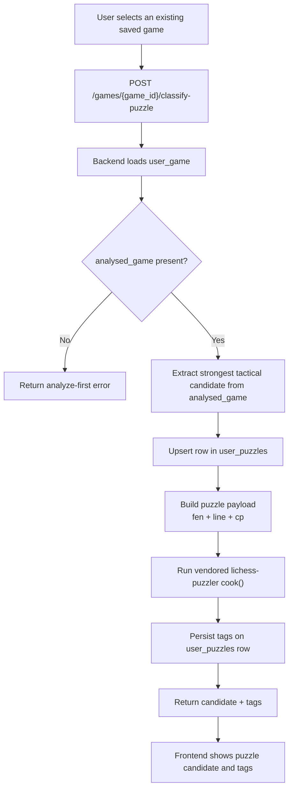

# Stored User Game To Puzzle Tags

## Goal

Support this flow in the app:

`stored user game -> extract best puzzle candidate from saved analysis -> persist puzzle candidate -> classify with Lichess-style tags -> show tags in UI`

The game already exists in `user_games`, so the entry point should be `game_id`, not pasted PGN.

## Recommended Architecture

Use the stored `analysed_game` data whenever possible.

- If a game already has `analysed_game`, extract the puzzle candidate directly from that saved analysis.
- If a game is not analyzed yet, run the existing analysis pipeline first, save the result, then classify it.

This avoids re-running PGN parsing and Stockfish work for games we have already processed.

## Puzzle Candidate Storage

Add a dedicated puzzle table so extracted candidates are persisted instead of recomputed every time.

Recommended table: `user_puzzles`

Each row should belong to:
- a `user_id`
- a source `game_id`

Each row should store:
- `puzzle_id`
- `user_id`
- `game_id`
- `start_fen`
- `source_half_move_index`
- `played_move`
- `best_move`
- `solution_uci` as JSON list
- `cp`
- `raw_tags` as JSON list
- `normalized_tags` as JSON list
- `candidate_score`
- `status`

Recommended `status` values:
- `candidate`
- `classified`
- `rejected`

Recommended uniqueness rule for MVP:
- one stored primary candidate per `(user_id, game_id, source_half_move_index)`

## Implementation Plan

1. Add a backend puzzle extraction service for stored games.
   Create a backend service that accepts a `game_id`, loads the corresponding `user_game`, and reads:
   - `pgn`
   - `analysed_game`
   - `time_class`
   - metadata about the user side

2. Extract the strongest puzzle candidate from `analysed_game`.
   Scan analyzed moves and score tactical moments using:
   - `classification` of `blunder` or `mistake`
   - large `cp_loss`
   - available `best_move`
   - available `top_lines`

3. Build a puzzle candidate payload.
   Use:
   - `fen_before` of the selected move as the puzzle start position
   - the played move plus the engine PV as the puzzle line
   - a `cp` estimate for difficulty-style tags such as `advantage`, `crushing`, and `equality`

4. Add persistent puzzle candidate storage.
   Create a `user_puzzles` table plus repository methods to:
   - create a puzzle candidate from a stored game
   - fetch puzzles by `user_id`
   - fetch puzzles by `game_id`
   - upsert tags after classification

5. Vendor the official Lichess tagger into the backend.
   Copy the minimal `lichess-puzzler` tagger files into a backend service package and wrap them behind a local service API.

6. Add a backend classification endpoint for stored games.
   Create an endpoint like:
   - `POST /games/{game_id}/classify-puzzle`

   The backend should:
   - verify the game belongs to the current user
   - ensure analysis exists
   - extract the best candidate
   - save or update the candidate in `user_puzzles`
   - classify it with the Lichess tagger
   - persist returned tags on the stored puzzle row
   - return both the stored candidate and the tags

7. Add a fallback for unanalyzed games.
   For MVP, return a helpful error such as `Game must be analyzed before classification`.
   Later, we can add automatic analyze-then-classify behavior.

8. Add a frontend service for the new flow.
   Add a helper like:
   - `classifyStoredGame(gameId)`

   This should call the backend endpoint and return:
   - candidate details
   - raw tags
   - optional normalized tags

9. Surface classification in the existing game UI.
   The best first integration point is the existing game analysis page.
   Add a button on the game page to:
   - classify this game
   - show the extracted candidate move
   - show returned tags

10. Verify end-to-end.
   Test:
   - analyzed game with a clear tactical blunder
   - analyzed game with no good candidate
   - unanalyzed game
   - unauthorized game access
   - repeated classification of the same game reuses or updates the stored puzzle row

## MVP Scope

- One best candidate per stored game
- Use saved `analysed_game` only
- Core official Lichess tags
- Trigger classification from an existing saved game
- Persist the extracted candidate in `user_puzzles`

## Follow-Ups

- Auto-analyze then classify when `analysed_game` is missing
- Multiple puzzle candidates per game
- Save generated puzzle records in the database
- Add filters and practice queues by tag
- Optional normalization to CSV theme names

## API Shape

### Request

`POST /games/{game_id}/classify-puzzle`

No body needed for MVP.

### Response

- `game_id`
- `puzzle_id`
- `candidate`
  - `start_fen`
  - `source_half_move_index`
  - `played_move`
  - `best_move`
  - `solution_uci`
  - `cp`
- `raw_tags`
- `normalized_tags`
- `warnings`

## Flow Diagram

